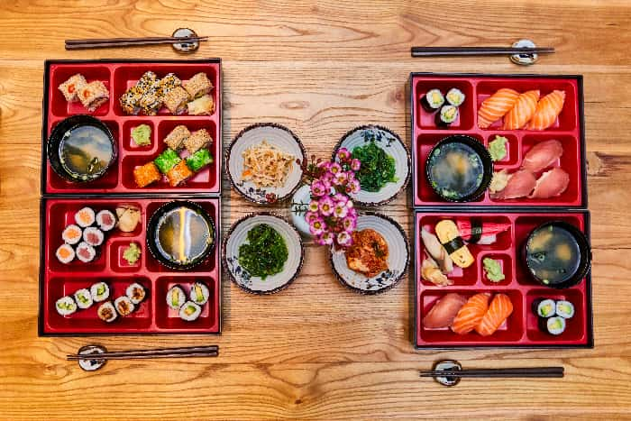

If you haven't learned about Bento Box Design yet, it's a newer trend for displaying information in a compact and fun (and delicious) way. It's based on the design of Japanese lunches, split into divided squares and rectangles for the different ingredients.

<figure>
    
    <figcaption>Example of a Bento Box by <a href="https://unsplash.com/@kofookoo?utm_content=creditCopyText&utm_medium=referral&utm_source=unsplash">kofookoo.de</a> on <a href="https://unsplash.com/photos/red-and-green-ceramic-bowls-on-brown-wooden-tray-UQE3rtWMfV4?utm_content=creditCopyText&utm_medium=referral&utm_source=unsplash">Unsplash</a>
      </figcaption>
</figure>

If you haven't already, I recommend checking out the [bentobox](https://bentobox.com/). It's a gorgeous gallery of Bento Box Designs around the web?

<figure>
    
    <figcaption>Example of an unused bento box design for the web
      </figcaption>
</figure>

I'm working on building one for the first time right now, so I'm learning how to build a responsive, fluid version myself. Here are the list of resources I've found useful so far:

## Tutorials

- [8 CSS Snippets for Creating Bento Grid Layouts](https://www.codemotion.com/magazine/frontend/lets-create-a-bento-box-design-layout-using-modern-css/)
- [Build a bento layout with CSS grid](https://iamsteve.me/blog/bento-layout-css-grid)
- Somehow, another, different [8 CSS Snippets for Creating Bento Grid Layouts](https://techstudio75.com/8-css-snippets-for-creating-bento-grid-layouts/)

## Generators

- [Bento Generator](https://bento-generator.jeanrobertou.com)
- [Bento Tailwind](https://bentotailwind.com) (paid)
- [Make It Grid](https://www.makeitgrid.com)

I hope this helps! I'm building a demo just for fun, with AI images to make it look alien...
